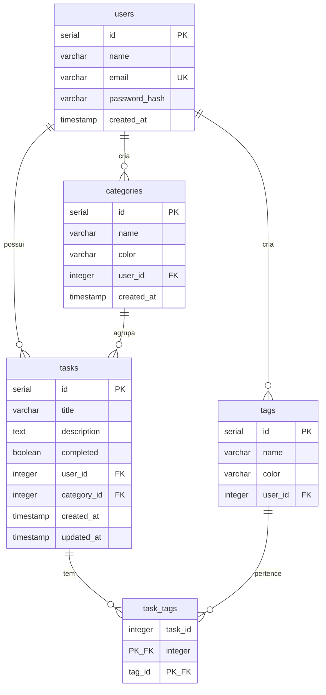

# Diagrama ER - Todolist02

```mermaid
erDiagram
    users {
        serial id PK
        varchar name
        varchar email UK
        varchar password_hash
        timestamp created_at
    }

    categories {
        serial id PK
        varchar name
        varchar color
        integer user_id FK
        timestamp created_at
    }

    tags {
        serial id PK
        varchar name
        varchar color
        integer user_id FK
    }

    tasks {
        serial id PK
        varchar title
        text description
        boolean completed
        integer user_id FK
        integer category_id FK
        timestamp created_at
        timestamp updated_at
    }

    task_tags {
        integer task_id PK_FK
        integer tag_id PK_FK
    }

    users ||--o{ tasks : "possui"
    users ||--o{ categories : "cria"
    users ||--o{ tags : "cria"
    categories ||--o{ tasks : "agrupa"
    tasks ||--o{ task_tags : "tem"
    tags ||--o{ task_tags : "pertence"
```
